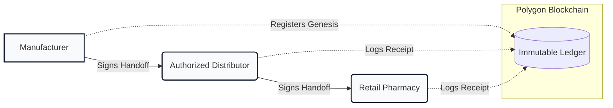
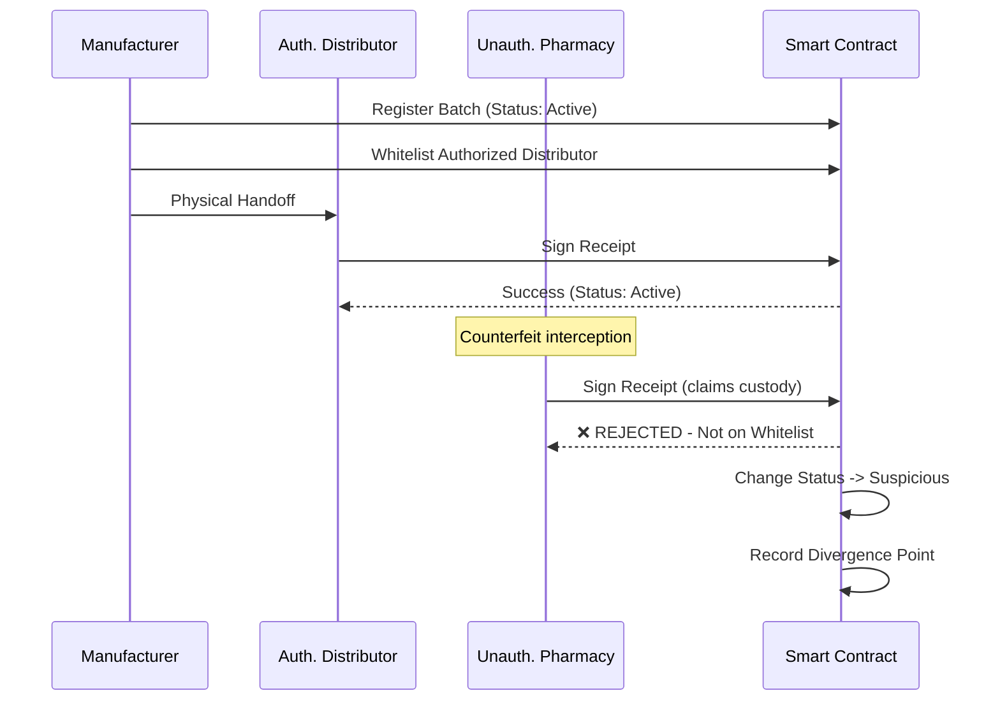
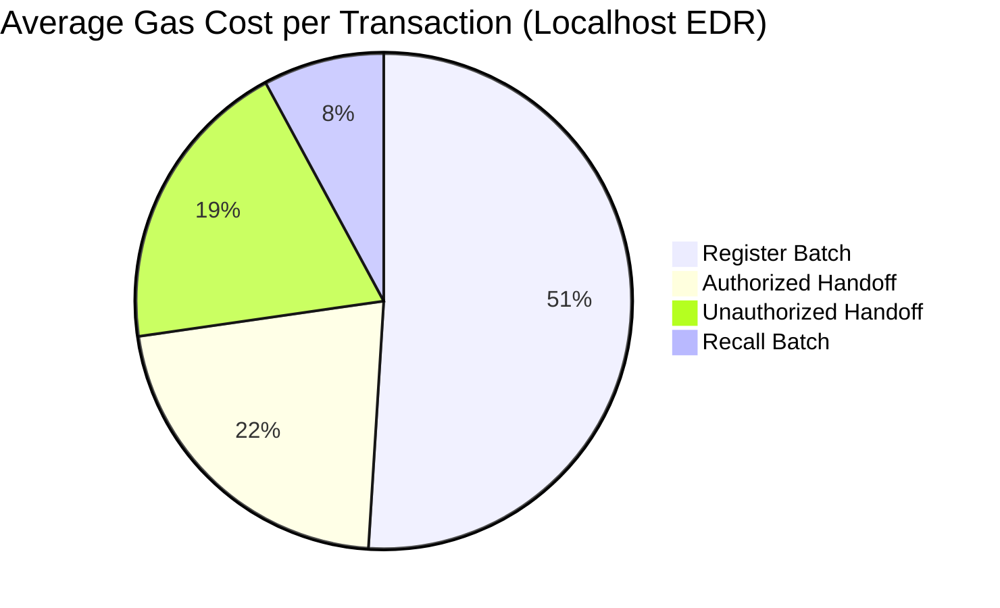

<div align="center">
  
  
  # ChainTrace Health
  
  **Enterprise-Grade Blockchain Supply Chain Traceability**  
  *Zero-trust medicine tracking with automated counterfeit detection & cryptographic custody verification.*

  <p align="center">
    <a href="#"></a>
    <a href="#"></a>
    <a href="#"></a>
    <a href="#"></a>
    <a href="#"></a>
  </p>
</div>

---

## 📖 The Problem

The global counterfeit drug market costs thousands of lives and billions of dollars annually. Current regulatory mandates (like India's Schedule H2) rely on easily forgeable QR codes without an underlying immutable ledger. **If a QR code can be printed, it can be faked.**

## 💡 The Solution

**ChainTrace Health** solves this by enforcing a **cryptographic chain of custody**. Every time a batch of medicine changes hands, the receiver must sign a transaction on the Polygon blockchain. The smart contract mathematically verifies the handoff against the manufacturer's whitelist, creating an unbreakable, immutable timeline.

---

## 🚀 Live Demo & Environments

| Service | Environment | Endpoint |
|---|---|---|
| **Frontend UI** | Vercel (Prod) / Localhost | [`https://chaintrace-health.vercel.app/`](https://chaintrace-health.vercel.app/) |
| **Smart Contract** | Polygon Amoy (Testnet) | [`0x9fE46736679d...`](https://amoy.polygonscan.com/) |
| **Backend API** | Vercel Serverless | `/api/batches`, `/api/verify` |

---

## ✨ Key Features

- 🔗 **Immutable Provenance:** Every custody transfer is cryptographically signed and stored on-chain.
- 🚨 **Automated Divergence Detection:** The smart contract automatically flags unauthorized interceptions in real-time.
- 📱 **Public Verification Portal:** Consumers can scan a physical QR code to instantly view a medicine's entire journey without an app or login.
- 🎨 **Premium UI/UX:** Built with a clean, light-mode SaaS aesthetic, neumorphic 3D illustrations, and smooth spring animations.
- ⚡ **Hybrid Architecture:** Combines the security of Polygon with the speed of Supabase for instantaneous dashboard queries.

---

## 🏗 System Architecture

The protocol uses a zero-trust handoff model. The contract guarantees that a batch can only be legally possessed by an entity authorized by the *previous* custodian.



## 🚨 Automated Divergence Detection Protocol

When an unauthorized entity (e.g., a parallel importer or counterfeit distributor) attempts to inject themselves into the chain, the smart contract intercepts the transaction and isolates the divergence point.



---

## 🛠 Technology Stack

| Category | Technologies Used |
|---|---|
| **Blockchain / Web3** | Solidity `^0.8.0`, Hardhat, Ethers.js v6, Wagmi v3, Viem |
| **Frontend Framework**| React 19, Vite, React Router v6 |
| **Styling & Motion** | Tailwind CSS v3, Framer Motion |
| **Backend & APIs** | Vercel Serverless Functions (ESM) |
| **Database & Cache** | Supabase (PostgreSQL) |

---

## 🎨 Design System

We employ a **Premium Light Mode SaaS** aesthetic designed for clarity, trust, and speed.

| Token | Value | Hex |
|---|---|---|
| **Background** | Clean Off-White | `#F8FAFC` / `#FFFFFF` |
| **Accent** | Deep Fuchsia | `#C2185B` / `fuchsia-700` |
| **Text** | Near-Black | `#0F172A` / `slate-900` |

**Typography:**
- **Inter**: Primary UI, body copy, and headings.
- **JetBrains Mono**: Cryptographic hashes, batch IDs, and wallet addresses.

**Visual Features:**
- Skeumorphic/Neumorphic 3D Hero illustrations.
- Smooth spring-based layout animations (`framer-motion`).
- Seamless scrolling SVG wave gradients.

---

## 📊 Smart Contract Performance

On-chain operations are highly optimized for low gas usage, ensuring the marginal cost of automated verification remains negligible at scale.



*Note: View operations (like `verifyBatch`) cost 0 gas and return in <15ms.*

---

## 📂 Repository Structure

```text
d:\btese\
├── contracts/          # Core Solidity contract
├── scripts/            # Hardhat deploy & seed scripts
├── test/               # Mocha + Chai unit tests (37 passing)
├── api/                # Vercel serverless API routes
├── src/                # Vite/React frontend
│   ├── components/     # UI Components (Nav, Timeline, etc)
│   ├── pages/          # Dashboards & Public Verify page
│   └── lib/            # Shared utilities and API client
├── supabase/           # Postgres schema
└── public/             # Static assets (including logo.svg)
```

---

## ⚙️ Getting Started

### Prerequisites
- Node.js 18+
- Supabase Project (Free Tier)
- Polygon Amoy RPC URL & Wallet Private Key

### Local Setup
1. Clone the repository and install dependencies:
   ```bash
   git clone https://github.com/your-org/chaintrace-health.git
   cd chaintrace-health
   npm install
   ```
2. Copy `.env.example` to `.env` and configure your credentials.
3. Start the local Hardhat node:
   ```bash
   npx hardhat node
   ```
4. Deploy the contract and seed test data:
   ```bash
   npm run deploy:local
   npm run seed:local
   ```
5. Start the frontend:
   ```bash
   npm run dev
   ```

*For full production deployment instructions to Vercel and Polygon Amoy, please refer to the `SETUP.md` guide.*

---
<div align="center">
  <sub>Built for the future of decentralized healthcare.</sub>
</div>
